# Jarkom_Modul3_Lapres_A14
Laporan Resmi Modul 3 Praktikum Jaringan Komputer
#
- Rofita Siti Musdalifah    (05111840000034)
- Vachri Attala Putra       (05111840000043)
#

## Soal
1. [Soal1](#soal1)
2. [Soal2](#soal2)
3. [Soal3-Soal6](#Soal3-Soal6)
4. [Soal7-Soal11](#Soal7-Soal11)
5. [Soal12](#soal12)
#

### Soal1

**Melakukan Setting Topologi**
#
- Membuat file **topologi.sh** yang berisi:
```
# Switch
uml_switch -unix switch1 > /dev/null < /dev/null &
uml_switch -unix switch2 > /dev/null < /dev/null &
uml_switch -unix switch3 > /dev/null < /dev/null &

# Router
xterm -T SURABAYA -e linux ubd0=SURABAYA,jarkom umid=SURABAYA eth0=tuntap,,,10.151.72.61 eth1=daemon,,,switch1 eth2=daemon,,,switch3 eth3=daemon,,,switch2 mem=256M &

# Server
xterm -T MALANG -e linux ubd0=MALANG,jarkom umid=MALANG eth0=daemon,,,switch2 mem=160M &
xterm -T MOJOKERTO -e linux ubd0=MOJOKERTO,jarkom umid=MOJOKERTO eth0=daemon,,,switch2 mem=128M &
xterm -T TUBAN -e linux ubd0=TUBAN,jarkom umid=TUBAN eth0=daemon,,,switch2 mem=128M &

# Klien
xterm -T BANYUWANGI -e linux ubd0=BANYUWANGI,jarkom umid=BANYUWANGI eth0=daemon,,,switch3 mem=64M &
xterm -T MADIUN -e linux ubd0=MADIUN,jarkom umid=MADIUN eth0=daemon,,,switch3 mem=64M &
xterm -T SIDOARJO -e linux ubd0=SIDOARJO,jarkom umid=SIDOARJO eth0=daemon,,,switch1 mem=64M &
xterm -T GRESIK -e linux ubd0=GRESIK,jarkom umid=GRESIK eth0=daemon,,,switch1 mem=64M &
```

- Kemudian setelah masuk ke UML, pada router SURABAYA lakukan setting sysctl dengan mengetikkan perintah ```nano /etc/sysctl.conf```. Hilangkan tanda pagar (#) pada bagian ```net.ipv4.ip_forward=1```. Lalu mengetikkan ```sysctl -p``` untuk mengaktifkan perubahan yang ada. Dengan mengaktifkan fungsi IP Forward ini maka Linux nantinya dapat menentukan jalur mana yang dipilih untuk mencapai jaringan tujuan.

- Lalu dilakukan setting IP pada setiap UML dengan mengetikkan ```nano /etc/network/interfaces``` Lalu setting sebagai berikut:

**SURABAYA (Sebagai Router / DHCP Relay)**

> 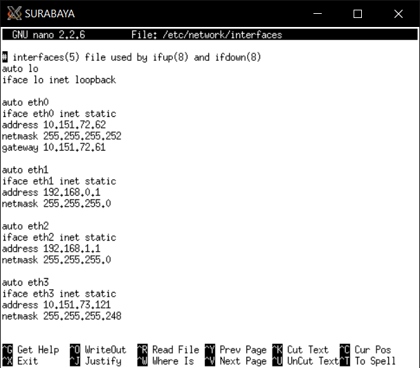

**MALANG (Sebagai DNS Server)**

> 


**MOJOKERTO (Sebagai Proxy Server)**

> 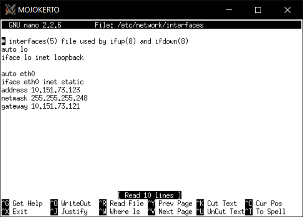


**TUBAN (Sebagai DHCP Server)**

> 

- Kemudian restart network dengan mengetikkan ```service networking restart``` di setiap UML.

- Serta memberikan perintah ```apt-get update``` juga pada setiap UML untuk melakukan update.

### Soal2
#### SURABAYA menjadi DHCP Relay
#
**Pada UML SURABAYA**
- Install isc-dhcp-relay dengan perintah ```apt-get install isc-dhcp-relay```.
- Kemudian isikan IP Servers dengan IP **TUBAN** sebagai DHCP Servernya, yaitu ```10.151.73.124```.
- Kemudian isikan interfaces dengan ```eth1 eth2 eth3```.
- Kosongkan bagian options:

> 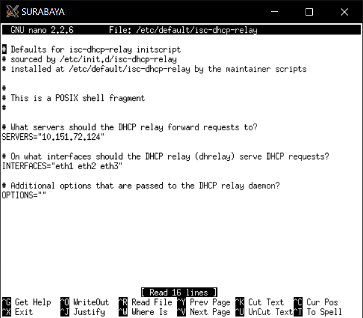


### Soal3-Soal6
**Pada UML TUBAN**
- Install isc-dhcp-server dengan perintah ```apt-get install isc-dhcp-server```.
- Kemudian mengedit file dengan perintah ```nano /etc/default/isc-dhcp-server```. Bagian interface diisikan ```eth0```.

> 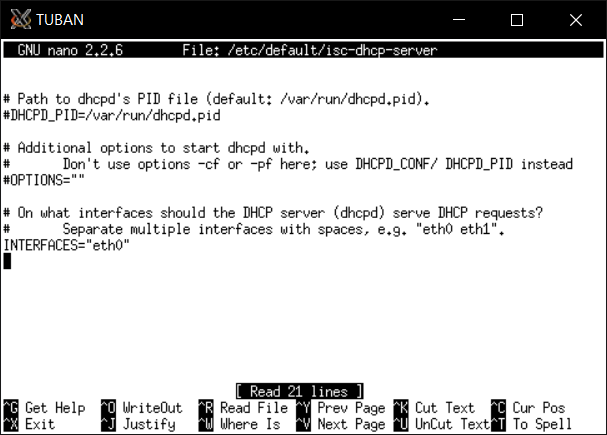

- Kemudian mengedit file dengan perintah ```nano /etc/dhcp/dhcpd.conf```. Ditambahkan sesuai gambar di bawah:

> 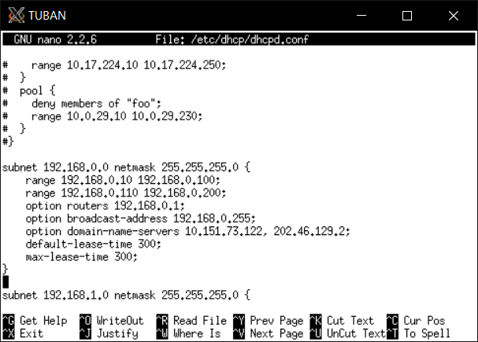
> 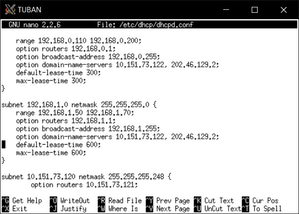

- Kemudian service isc-dhcp-server di-restart 


Selanjutnya mengubah file ```/etc/network/interfaces``` pada klien menjadi:

```
auto lo
iface lo inet loopback

auto eth0
iface eth0 inet dhcp
```

Kemudian dilakukan restart network: ```service networking restart```.
Maka ketika dijalankan ```ifconfig``` sehingga terlihat pada setiap UML sebagai berikut:

**Pada SUBNET 1 yaitu UML GRESIK dan UML SIDOARJO serta SUBNET 3 yaitu UML BANYUWANGI dan UML MADIUN**

> 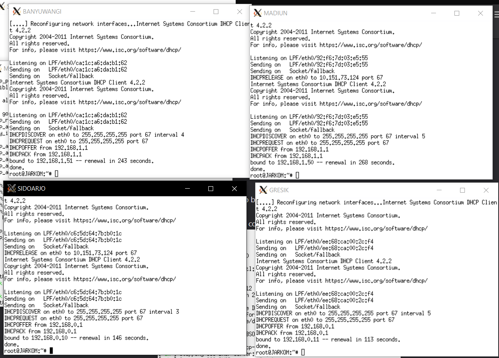

- Karena sudah sesuai, maka berarti setting DHCP sudah berhasil.

### Soal7-Soal11
- Pada proxy server, yaitu UML **MOJOKERTO** akan diinstall squid terlebih dahulu dengan perintah ```apt-get install squid```.
- Kemudian mengedit file dengan perintah ```nano /etc/squid/squid.conf``` menjadi gambar berikut untuk menjawab soal no 7-11:

> 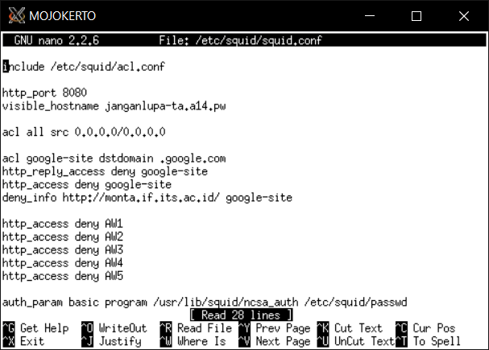

- Untuk soal no7, perlu dilakukan pendaftaran username dan password dengan cara meng-install apache-utils terlebih dahulu dengan perintah ```apt-get install apache2-utils```.
- Kemudian masukkan akun baru dengan ```htpasswd -c /etc/squid/passwd userta_a14``` dan masukkan password yang sesuai yaitu ```inipassw0rdta_a14```.
- Pada file ```squid.conf``` ditambahkan perintah berikut:
```
auth_param basic program /usr/lib/squid/ncsa_auth /etc/squid/passwd
auth_param basic children 5
auth_param basic realm Proxy
auth_param basic credentialsttl 2 hours
auth_param basic casesensitive on
acl USERS proxy_auth REQUIRED
http_access allow USERS
```
- Sehingga saat diakses muncul autentikasi sebagai berikut:

> 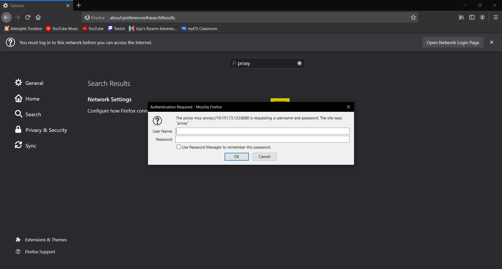

- Untuk soal no 8 dan 9, edit file acl.conf ```nano /etc/squid/acl.conf``` ditambahkan perintah seperti gambar berikut (waktu kebalikannya), karena menggunakan perintah **deny**:

> 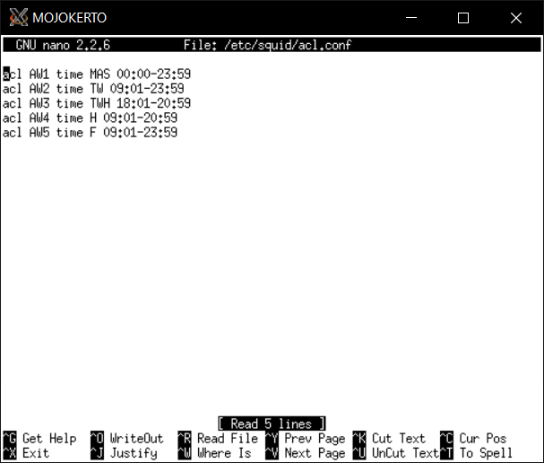

- Kemudian untuk soal no10, ditambahkan perintah pada ```/etc/squid/squid.conf``` dengan perintah:
```
acl google-site dstdomain google.com
deny_info http://monta.if.its.ac.id google-site
http_reply_access deny google-site
```

- Untuk soal no11, untuk mengubah default error page, kita dapat memindahkan custom error page kita ke folder ```/usr/share/squid/errors/English```, jadi setelah kita download dengan perintah ```wget 10.151.36.202/ERR_ACCESS_DENIED```, kita copy-kan ke folder tersebut. Untuk isi default folder tersebut dapat dipindah dahulu ke folder temporary lainnya dengan perintah ```mv /usr/share/squid/errors/English /usr/share/squid/errors/English2```, kemudian meng-copy file kita ke folder tersebut dengan perintah ```cp -r ERR_ACCESS_DENIED /usr/share/squid/errors/English/```. Jika mengakses di saat jam yang seharusnya di-deny akan muncul seperti gambar berikut:

> 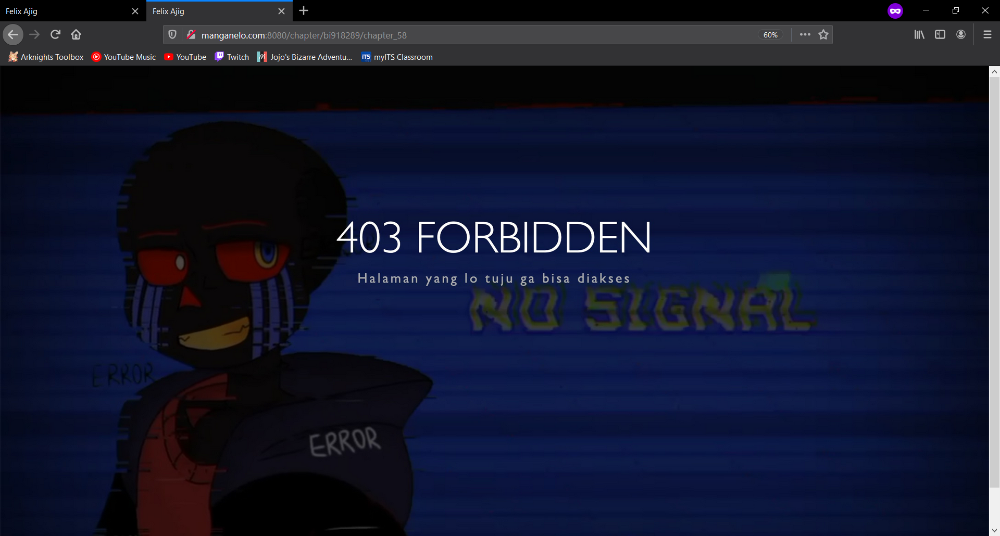

### Soal12
- Perlu dilakukan setting DNS Server terlebih dahulu pada UML **MALANG**, yaitu dengan instalasi ```apt-get install bind9 -y```.
- Kemudian tambah zone pada ```nano /etc/bind/named.conf.local``` untuk file ```/etc/bind/janganlupa/janganlupa-ta.a14.pw```
- Kemudian buat folder baru: ```mkdir /etc/bind/janganlupa```
- Dan copy file db.local ke folder yang baru saja dibuat dan mengganti namanya sesuai domain yang diinginkan: ```cp /etc/bind/db.local /etc/bind/janganlupa/janganlupa-ta.a14.pw```
- Kemudian buka file ```janganlupa-ta.a14.pw``` dengan perintah: ```nano /etc/bind/janganlupa/janganlupata-a14.pw```. Edit sesuai gambar di bawah:

> 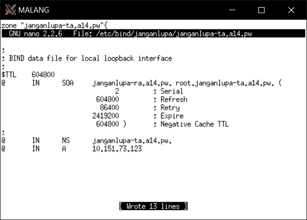

- Kemudian setelah itu melakukan restart service bind9 dengan perintah ```service bind9 restart```.
- Maka kita bisa mengakses proxy dengan menggunakan domain ```janganlupa-ta.a14.pw```

> 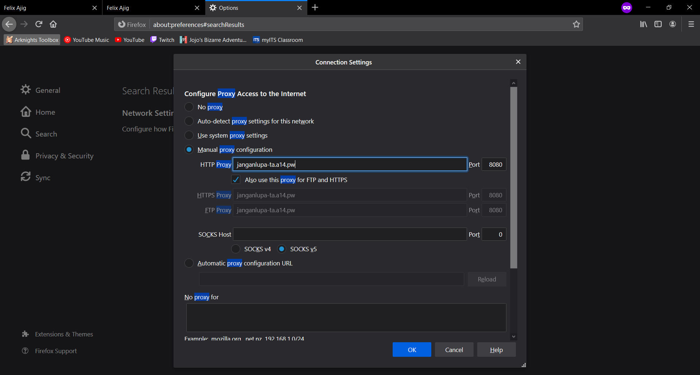


##  Hambatan Selama Pengerjaan
- Sedikit kesulitan ketika melakukan config DHCP relay, karena sumber-sumber yang dipakai di awal kurang lengkap sehingga menyebabkan beberapa error
- Error pada klien subnet 1 yang menghabiskan banyak waktu untuk memperbaiki, namun ternyata disebabkan sedikit typo pada setting topologi
